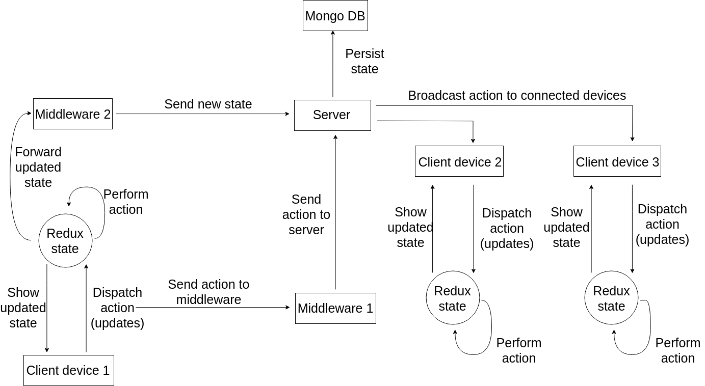

# Online OS

## TL;DR
Online OS uses web sockets to sync user actions between multiple user devices in real time, enabling seamless transition between them.

## Features
- OS as a service.
- Work on one device and then continue on another one.
- No need to start programs on multiple devices.
- Completely web-based, work on any device that connects to internet.

## The Idea
Online OS is an attempt at creating an OS that can be accessed on any device, so a user having a laptop and a phone can use the same OS, use the same apps and have the same state of everything synced between all their devices. Beacase the OS is built using React and other web technologies, it can work on any device that can connect to the interent. 

## Why something like this is good (motivation, arguments):
Well, there are many companies in the world, and they all like to create their own platforms and have users sign up to use their services. This leads to people having many accounts and passwords which is inconvenient, and also leads to a high degree of fragmentation because not every service or product from one company works with those from other companies (even tough they could technically). 

Having multiple devices (phone, tablet, laptop, smartwatch, etc) connected to the same OS allows for seamless integration between the devices and allows the user to switch between any of them and use the hardware features of the current device (phone's camera), all while having the state synced to the cloud (and the other devices).

## Why not just use a VM that is streamed to different devices?
1) Streaming 4k video (or something like teamviewer) takes too much bandwitdh and is not very efficient.
2) A VM running in the cloud will not easily have access to the hardware features of the device the user happens to be using.
3) Using web technologies allows for the customization of the UI of applications to the current device the user is using.
4) As JavaScript and front end frameworks keep advancing, it is becoming more and more possible to do things on the client side instead of relying on backends. Having said that, using a VM might be needed to run some programs (like Photoshop) and to use cloud computing (playing games or running expensive operations), so a mix of the two would definetely be better. Streaming a VM though is not the solution.

## How does all this work?
1) A user connects to Online OS (on their laptop for example).
2) The OS latest state (from previous visits) is transfered to the user.
3) When the user does something, an action message is sent through a socket connection to [the server](https://github.com/yousifmansour/online-os-server).
4) After the message is received, the server then broadcasts it to any other connected devices (the user's phone).
5) The user's other devicecs receive the message and apply it on their state.
6) The user is able to work on one device and then continue on any other without interruptions.
7) Open applications' state and uploaded files are always synced and up to date on all devices.

## Some Technical Details
- The UI of the OS and all the apps are built with **React** and use **CSS Flexbox** to be responsive and adapt to any device that might acess it.
- **Redux** is used for state managemengt. Middleware for Redux sends every action message to the server asynchronously using **socketio** so that it is ditributed to the other devices.
- [**Node.js** server](https://github.com/yousifmansour/online-os-server) on the backends coordinates the action broadcasting with the **socketio** connections, and makes sure to not send an action recevied by one user back to it (because that would lead to an infitinte loop).
- The server stores the OS state (which is Redux state) to a **MongoDB** to maintain it.

This was my graduation project in AUB, I worked on it with Prof. George Turkiyyah.

This is the poster I made for it.

